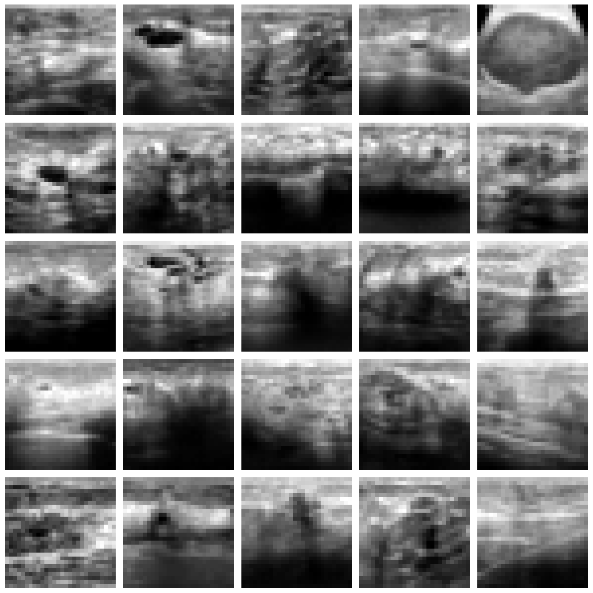
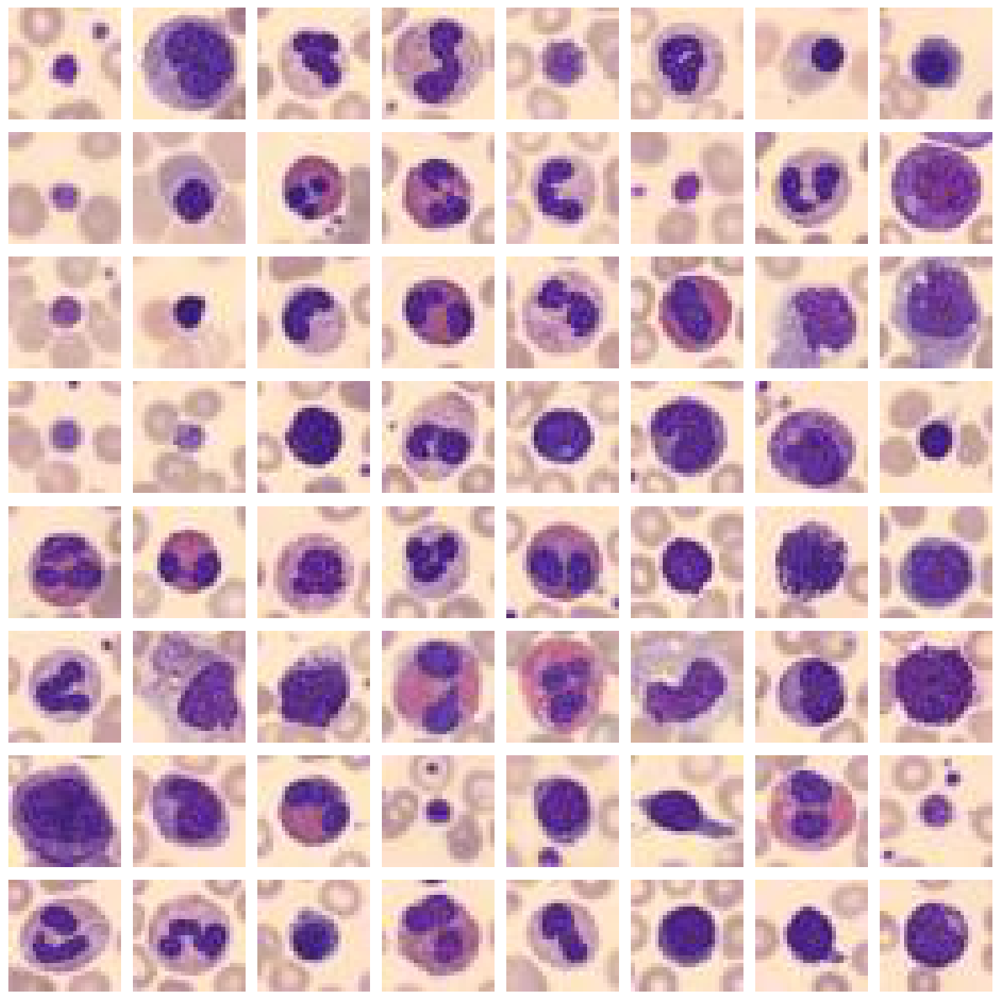

# AMLS_24_25_SN21024516

This project focuses on medical image classification using state-of-the-art machine learning and deep learning models. It involves solving classification tasks on two datasets, **BreastMNIST** and **BloodMNIST**, utilizing models like Support Vector Machines (SVM), Convolutional Neural Networks (CNN), ResNet18, and Vision Transformers (ViT-B16).

---

## **Introduction**

Medical imaging plays a crucial role in modern healthcare by enabling accurate diagnosis of diseases. Machine learning has significantly enhanced the ability to classify and analyze medical images. This project explores binary classification for **BreastMNIST**, which consists of grayscale ultrasound images, and multi-class classification for **BloodMNIST**, which contains RGB images of blood cells.

### **Sample Images from the Datasets**
#### BreastMNIST
BreastMNIST includes ultrasound scans of breast tumors, labeled as either benign (non-cancerous) or malignant (cancerous):



#### BloodMNIST
BloodMNIST consists of 8 blood cell types, such as basophils, eosinophils, and neutrophils. Below are some representative samples from the dataset:



---

## **Setup Instructions**

### **1. Clone the Repository**
Clone this repository to your local machine:
```bash
git clone <repository-url>
cd AMLS_24_25_SN21024516
```

### **2. Create and Activate the Environment**
Use Conda to set up the project environment:

1. **Create a new environment**:
   ```bash
   conda create --name mls-i python=3.9
   ```

2. **Activate the environment**:
   ```bash
   conda activate mls-i
   ```

3. **Install required dependencies**:
   ```bash
   pip install -r requirements.txt
   ```

---

## **Project Workflow**

1. **BreastMNIST**:
   - **Models**: SVM and CNN.
   - **Goal**: Binary classification into benign and malignant tumors.
   - **Evaluation**: F1-Score, ROC-AUC, and confusion matrix analysis.

2. **BloodMNIST**:
   - **Models**: ResNet18 and ViT-B16 (transfer learning).
   - **Goal**: Multi-class classification into 8 blood cell types.
   - **Evaluation**: Per-class F1-Scores, macro and weighted F1-Scores.

---

## **Run the Program**

To execute the program:
```bash
python main.py
```
---

## **Outputs**

- **Figures**: Visualizations of model performance (e.g., confusion matrices, training curves) are saved in `A/figure` and `B/figure` directories.
- **Logs**: Training and validation logs are stored in `A/log` and `B/log` directories.
- **Models**: Best-performing model checkpoints are saved in `A/models` and `B/models`.

---

## **Troubleshooting**

### **1. Missing Dependencies**
Ensure the environment is activated and reinstall dependencies:
```bash
pip install -r requirements.txt
```

### **2. Environment Issues**
Recreate the environment if necessary:
```bash
conda remove --name mls-i --all
conda create --name mls-i python=3.9
pip install -r requirements.txt
```

---

## **Contributors**

- **Yuanzhe Hu**

---

## **License**

This project is licensed under the MIT License. See the `LICENSE` file for details.
